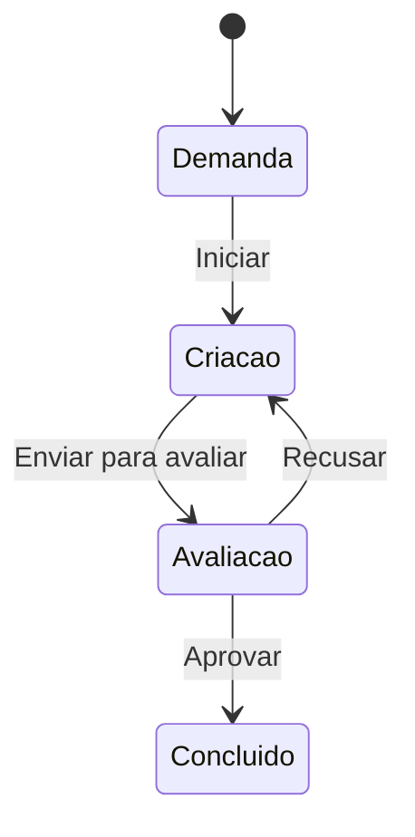

# InovaLab — Cenários base e rastreabilidade

Versão 0.1 • 01/10/2026. Cenários escritos para orientar validação e futuros testes, não como testes já executados. Dados e nomes são exemplos fictícios. C/D/P e Q01–Q14 estão definidos em `01-InovaLab-Escopo-e-Requisitos.md`.

## 1. Fluxo proposto das tarefas

O PDF confirma os quatro estados e o retorno de avaliação para criação em caso de recusa. A sequência completa abaixo e a autoridade de cada transição são propostas pendentes de Q03.

Não há estado `re-criar`. Não há fluxo aprovado de reabertura ou de avanço direto para concluído. Até definir Q03, não interpretar este diagrama como uma permissão para restringir direitos já descritos no PDF.

## 2. Cenários de tarefas e acesso

### CT01 — Criar demanda e atribuir responsável

**UC03; RF03–RF04; C/D.** Dado um administrador autenticado, um serviço Impressão 3D e a usuária Ana, quando o administrador cadastrar uma tarefa de produção de protótipo atribuída a Ana, então o registro deve ficar disponível ao administrador e a Ana. O estado inicial demanda é proposto. Bruno, outro usuário, não deve visualizar a tarefa.

### CT02 — Iniciar execução da própria tarefa

**UC04; RF05–RF07; C/P.** Dado que Ana é responsável pela tarefa em demanda e a transição está autorizada, quando alterar para criação, então somente o status e campos automáticos aprovados devem mudar. Serviço, responsável, descrição e prazo permanecem iguais.

### CT03 — Enviar para avaliação e aprovar

**UC04–UC05; RF06; P.** Dada uma tarefa em criação, quando Ana enviar para avaliação e o ator autorizado aprovar, então a tarefa passa a concluído. Pela proposta RN11, data de conclusão e evento são registrados. O ator que aprova depende de Q03.

### CT04 — Recusar e refazer

**UC05; RF06; C para retorno, P para ator/motivo.** Dada uma tarefa em avaliação, quando houver recusa pelo ator autorizado, então ela retorna à coluna criação. Nenhuma coluna “recriar” é criada. Depois da correção, pode voltar à avaliação conforme fluxo aprovado.

### CT05 — Impedir acesso à tarefa alheia

**UC02–UC04; RF02, RF05; C.** Dado que a tarefa pertence a Ana, quando Bruno tentar abri-la ou alterar seu status por URL ou requisição direta, então o servidor nega acesso, não retorna seus dados e não altera o registro.

### CT06 — Impedir edição de campo protegido

**UC04; RF05; C.** Dada uma tarefa de Ana, quando ela enviar alteração de status acompanhada de novo responsável ou prazo, então a operação deve ser rejeitada sem alteração parcial. O usuário comum não recebe permissão de editar esses campos por ser dono da tarefa.

### CT07 — Reatribuir tarefa

**UC03; RF02–RF03; C/D.** Dada uma tarefa de Ana, quando o administrador transferi-la para Bruno, então Bruno passa a vê-la e Ana perde acesso, inclusive por endereço anteriormente conhecido. O histórico preserva a atribuição anterior se RF21 for aprovado.

### CT08 — Atualizações concorrentes

**UC04; RF05, RNF04; P.** Dados dois clientes com a mesma versão de uma tarefa, quando um atualizar o estado e o outro enviar uma alteração baseada na versão antiga, então a segunda operação deve informar conflito e exigir atualização, evitando sobrescrita silenciosa.

## 3. Cenários de agenda e integração

### CT09 — Reservar espaço pela interface

**UC08; RF12–RF15; C/D.** Dado um espaço cadastrado e disponível, quando o administrador selecionar categoria espaço, esse objeto, requerente, motivo e intervalo de 14h a 15h, então o sistema salva o agendamento e o exibe na agenda unificada. A reserva não cria tarefa automaticamente pela proposta RN15.

### CT10 — Categoria e objeto incompatíveis

**UC08–UC09; RF15; D.** Quando uma solicitação declarar categoria equipamento e referenciar um espaço, então deve ser rejeitada sem gravar. O servidor valida isso mesmo que a interface filtre corretamente as opções.

### CT11 — Conflito de horários

**UC08–UC09; RF16; P.** Dada uma reserva exclusiva de 14h a 15h, quando outra solicitação para o mesmo recurso usar 14h30 a 15h30, então deve ser recusada. Um recurso diferente pode aceitar o mesmo horário. Para serviços, a regra depende de Q05.

### CT12 — Limite entre reservas

**UC08; RF16, RN07; P.** Dada uma reserva de 14h a 15h, quando a próxima começar exatamente às 15h, então deve ser permitida, salvo se for aprovada uma margem operacional de preparação ou limpeza.

### CT13 — Duas solicitações simultâneas

**UC08–UC09; RF16, RNF04; P.** Dado um recurso exclusivo livre, quando duas solicitações concorrentes tentarem reservar o mesmo intervalo, então apenas uma confirma. A outra recebe conflito; uma simples consulta prévia sem proteção no banco não satisfaz o cenário.

### CT14 — Editar sem conflitar consigo mesmo

**UC08; RF13, RF16; C/P.** Dada uma reserva existente, quando o admin alterar o motivo mantendo o horário, então a reserva não deve ser considerada conflito consigo mesma. Se alterar para intervalo ocupado por outra reserva do mesmo recurso exclusivo, a edição é rejeitada e os dados anteriores permanecem.

### CT15 — Horário inválido e indisponibilidade

**UC08–UC09; RF15–RF16; D/P.** Quando o fim for igual ou anterior ao início, então a solicitação é rejeitada. Quando o recurso estiver indisponível para o período, também é rejeitada conforme RN08. Um recurso apenas ocupado no momento pode estar livre em uma data futura; o status atual não substitui a agenda.

### CT16 — Solicitar pelo AgroHub

**UC09; RF14–RF15; C/D.** Dada uma integração autenticada e um solicitante externo identificado, quando o AgroHub enviar pedido válido, então a reserva entra na mesma agenda usada pelo administrador, mantendo requerente e referência externa. Não é obrigatório criar uma conta interna para o solicitante.

### CT17 — Reenvio após perda de resposta

**UC09; RF22; P.** Dado um pedido externo já persistido cuja resposta não chegou ao AgroHub, quando ocorrer reenvio com a mesma chave e conteúdo, então deve ser retornado o registro anterior. Não pode surgir uma segunda reserva. Conteúdo diferente usando a mesma chave deve gerar conflito explícito.

### CT18 — API sem autorização

**UC09; RNF03; P.** Quando uma chamada sem credencial válida tentar criar reserva, então nenhum registro é criado e nenhuma informação privada da agenda é revelada. O erro deve ser compreensível para o integrador e não conter segredos.

### CT19 — Remover agendamento

**UC08; RF13; C, semântica P.** Dada uma reserva selecionada pelo administrador, quando ele confirmar exclusão, então ela deixa de bloquear o intervalo. Apagar fisicamente ou manter cancelamento no histórico depende de Q08; a interface deve comunicar o resultado real adotado.

## 4. Cenários de cadastros, materiais e banners

### CT20 — Preservar referência de cadastro

**UC06; RF08–RF10, RN12; D.** Dado um serviço utilizado por tarefas, quando houver tentativa de exclusão, então o sistema impede referências quebradas. Bloqueio de exclusão ou desativação deve seguir a política aprovada, sem apagar tarefas em cascata inadvertidamente.

### CT21 — Cadastrar e corrigir material

**UC10; RF17, RN10; C/P.** Dado um material com quantidade 10 na unidade a definir, quando o ator autorizado corrigir a quantidade para 8, então o cadastro reflete 8. Valor negativo é rejeitado. Este cenário não presume baixa automática por execução de tarefa.

### CT22 — Publicar banner no local correto

**UC11–UC12; RF18–RF19; C/D.** Dado um banner ativo, com imagem WebP e local home, quando um visitante abrir home, então o banner elegível é exibido. Ele não aparece automaticamente em sobre. Banner inativo não aparece em nenhuma das páginas.

### CT23 — Agendar exibição de banner

**UC11–UC12; RF19; P.** Dado um banner agendado para um intervalo com fuso definido, quando o relógio atingir o início, então ele se torna elegível; no fim, deixa de ser. Antes disso, não aparece. Os campos de período precisam ser adicionados e aprovados em Q10.

### CT24 — Repetir carga de serviços iniciais

**UC06; RF11; C/D.** Dada a carga inicial já realizada, quando a rotina de carga for executada novamente, então os onze serviços não devem ser duplicados nem ter edições locais sobrescritas sem uma política explícita.

### CT25 — Encerrar sessão

**UC01; RF01; D.** Dada uma sessão autenticada, quando o usuário sair e tentar novamente uma operação privada com aquela sessão, então o acesso deve ser negado. Novo acesso exige autenticação.

## 5. Matriz de rastreabilidade funcional

| Requisito | Casos de uso | Cenários |
| --- | --- | --- |
| RF01 | UC01 | CT25 |
| RF02 | UC02 | CT01, CT05, CT07 |
| RF03 | UC03 | CT01, CT07 |
| RF04 | UC03 | CT01 |
| RF05 | UC04 | CT02, CT05, CT06, CT08 |
| RF06 | UC04, UC05 | CT03, CT04 |
| RF07 | UC02, UC04 | CT02, CT04 |
| RF08 | UC06 | CT15, CT20 |
| RF09 | UC06 | CT09, CT20 |
| RF10 | UC06 | CT20 |
| RF11 | UC06 | CT24 |
| RF12 | UC07, UC08 | CT09, CT16 |
| RF13 | UC08 | CT14, CT19 |
| RF14 | UC09 | CT16, CT18 |
| RF15 | UC08, UC09 | CT09, CT10, CT15, CT16 |
| RF16 | UC08, UC09 | CT11–CT15 |
| RF17 | UC10 | CT21 |
| RF18 | UC11 | CT22 |
| RF19 | UC11, UC12 | CT22, CT23 |
| RF20 | UC02 | CT05; complementar com filtros aprovados |
| RF21 | UC03, UC04, UC05 | CT03, CT07; complementar após definir eventos |
| RF22 | UC09 | CT17 |

Esta matriz indica cobertura base, não cobertura exaustiva. Os RNFs têm verificação própria no arquivo 01. Casos detalhados de campos obrigatórios, carga, recuperação e permissões dos cadastros dependem das decisões abertas.
