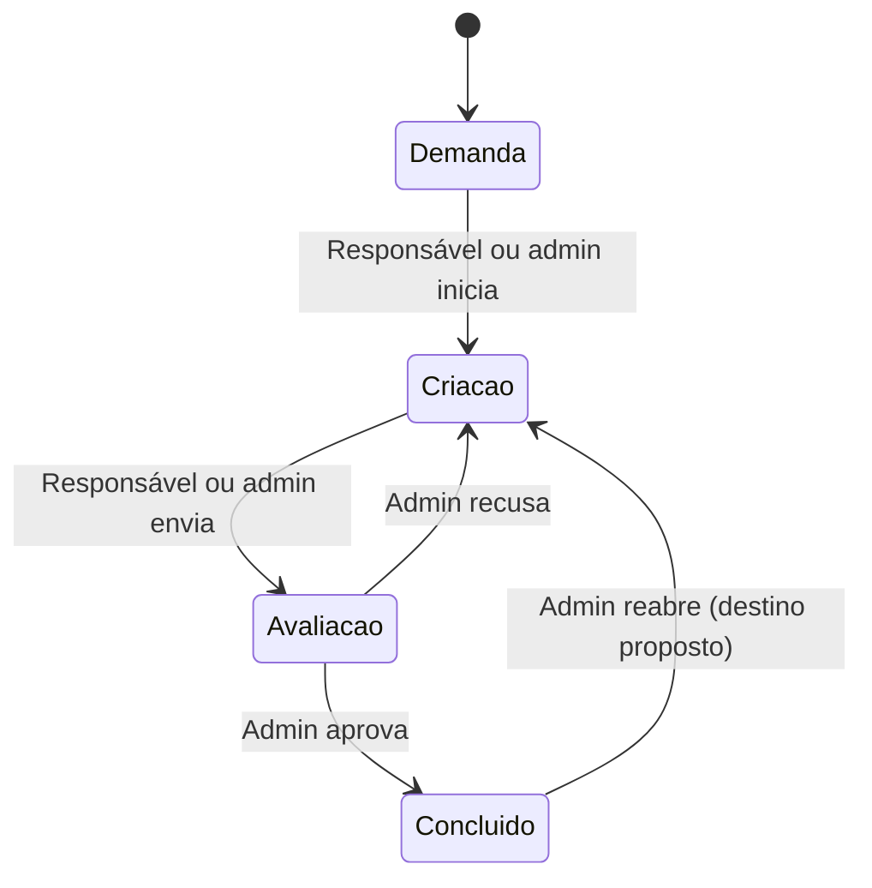

# InovaLab — Cenários base e rastreabilidade

Versão 0.3 • 02/10/2026. Cenários base para orientar validação; a cobertura executada da agenda está na seção 7. Dados e nomes são exemplos fictícios. C/D/P e Q01–Q15 estão definidos em `01-InovaLab-Escopo-e-Requisitos.md`.

## 1. Fluxo proposto das tarefas

O PDF original foi conferido: a página 2 lista inicialmente `re-criar`, mas a resposta da página 3 elimina essa etapa, resultando nos quatro estados e no retorno para criação em caso de recusa. F4 mostra o quadro nessas quatro colunas. F3 confirma que somente administradores aprovam, recusam e reabrem; o responsável executa e envia para avaliação. A sequência inicial e o destino da reabertura abaixo são propostas a validar.

Não há estado `re-criar`. A autoridade para reabrir está aprovada; retornar para criação é proposta. Avanço direto de demanda/criação para concluído e outras transições não estão aprovados. Datas automáticas e motivo de recusa continuam dependentes de Q04/RN11.

**Atualização da entrega de tarefas:** o responsável autorizou implementação direta com plano simples. O módulo 3 adota operacionalmente esse mapa, início real automático, prazo opcional com horário, conclusão automática e reabertura que limpa a conclusão atual preservando o evento anterior. Exclusão é lógica, com histórico retido; versão antiga retorna 409. Essas são escolhas de implementação para depuração, sem reclassificar propostas como respostas confirmadas. Motivo de recusa, anexos e comentários não foram acrescentados. Consulte o [guia](docs/modules/03-tarefas.md) para testes executados e contratos.

## 2. Cenários de tarefas e acesso

### CT01 — Criar demanda e atribuir responsável

**UC03; RF03–RF04; C/D.** Dado um administrador autenticado, um serviço Impressão 3D e a usuária Ana, quando o administrador cadastrar uma tarefa de produção de protótipo atribuída a Ana, então o registro deve ficar disponível ao administrador e a Ana. O estado inicial demanda é proposto. Bruno, outro usuário, não deve visualizar a tarefa.

### CT02 — Iniciar execução da própria tarefa

**UC04; RF05–RF07; C/P.** Dado que Ana é responsável pela tarefa em demanda e a transição está autorizada, quando alterar para criação, então somente o status e campos automáticos aprovados devem mudar. Serviço, responsável, descrição e prazo permanecem iguais.

### CT03 — Enviar para avaliação e aprovar

**UC04–UC05; RF06; C para atores F3, P para datas/histórico.** Dada uma tarefa em criação, quando Ana enviar para avaliação e um administrador aprovar, então a tarefa passa a concluído. Pela proposta RN11, data de conclusão e evento são registrados. Ana não pode aprovar a própria entrega.

### CT04 — Recusar e refazer

**UC05; RF06; C para retorno/ator, P para motivo.** Dada uma tarefa em avaliação, quando um administrador recusar, então ela retorna à coluna criação. Nenhuma coluna “recriar” é criada. Depois da correção, o responsável pode enviá-la novamente para avaliação.

### CT05 — Impedir acesso à tarefa alheia

**UC02–UC04; RF02, RF05; C.** Dado que a tarefa pertence a Ana, quando Bruno tentar abri-la ou alterar seu status por URL ou requisição direta, então o servidor nega acesso, não retorna seus dados e não altera o registro.

### CT06 — Impedir edição de campo protegido

**UC04; RF05; C.** Dada uma tarefa de Ana, quando ela enviar alteração de status acompanhada de novo responsável ou prazo, então a operação deve ser rejeitada sem alteração parcial. O usuário comum não recebe permissão de editar esses campos por ser dono da tarefa.

### CT07 — Reatribuir tarefa

**UC03; RF02–RF03; C/D.** Dada uma tarefa de Ana, quando o administrador transferi-la para Bruno, então Bruno passa a vê-la e Ana perde acesso, inclusive por endereço anteriormente conhecido. O histórico preserva a atribuição anterior se RF21 for aprovado.

### CT08 — Atualizações concorrentes

**UC04; RF05, RNF04; P.** Dados dois clientes com a mesma versão de uma tarefa, quando um atualizar o estado e o outro enviar uma alteração baseada na versão antiga, então a segunda operação deve informar conflito e exigir atualização, evitando sobrescrita silenciosa.

## 3. Cenários de agenda e integração

### CT09 — Reservar espaço pela interface

**UC08; RF12–RF15; C/D.** Dado um espaço cadastrado e disponível, quando o administrador selecionar categoria espaço, esse objeto, requerente, motivo e intervalo de 14h a 15h, então o sistema salva o agendamento e o exibe na agenda unificada. A reserva não cria tarefa automaticamente pela proposta RN15.

### CT10 — Categoria e objeto incompatíveis

**UC08–UC09; RF15; D.** Quando uma solicitação declarar categoria equipamento com ID inexistente nessa categoria, então deve ser rejeitada sem gravar. O servidor resolve o ID exclusivamente no catálogo da categoria e valida mesmo que a interface filtre corretamente as opções. IDs numéricos iguais em categorias distintas não representam o mesmo objeto; o contrato não usa uma referência genérica entre tabelas.

### CT11 — Conflito de horários

**UC08–UC09; RF16; exclusividade C — F3 em 02/10, proteção D.** Dada uma reserva de 14h a 15h, quando outra solicitação para o mesmo serviço, equipamento ou espaço usar 14h30 a 15h30, então deve ser recusada. Um objeto diferente pode aceitar o mesmo horário. Q05 confirmou exclusividade também para serviços.

### CT12 — Limite entre reservas

**UC08; RF16, RN07; P.** Dada uma reserva de 14h a 15h, quando a próxima começar exatamente às 15h, então deve ser permitida, salvo se for aprovada uma margem operacional de preparação ou limpeza.

### CT13 — Duas solicitações simultâneas

**UC08–UC09; RF16, RNF04; P.** Dado um recurso exclusivo livre, quando duas solicitações concorrentes tentarem reservar o mesmo intervalo, então apenas uma confirma. A outra recebe conflito; uma simples consulta prévia sem proteção no banco não satisfaz o cenário.

### CT14 — Editar sem conflitar consigo mesmo

**UC08; RF13, RF16; C/P.** Dada uma reserva existente, quando o admin alterar o motivo mantendo o horário, então a reserva não deve ser considerada conflito consigo mesma. Se alterar para intervalo ocupado por outra reserva do mesmo recurso exclusivo, a edição é rejeitada e os dados anteriores permanecem.

### CT15 — Horário inválido e indisponibilidade

**UC08–UC09; RF15–RF16; D/P.** Quando o fim for igual ou anterior ao início, então a solicitação é rejeitada. Quando o recurso estiver indisponível para o período, também é rejeitada conforme RN08. Um recurso apenas ocupado no momento pode estar livre em uma data futura; o status atual não substitui a agenda.

### CT16 — Solicitar pelo AgroHub

**UC09; RF14–RF15; C/D.** Dada uma integração autenticada e um solicitante externo identificado, quando o AgroHub enviar pedido válido, então a reserva entra na mesma agenda usada pelo administrador, mantendo requerente e referência externa. Não é obrigatório criar uma conta interna para o solicitante.

### CT17 — Reenvio após perda de resposta

**UC09; RF22; P.** Dado um pedido externo já persistido cuja resposta não chegou ao AgroHub, quando ocorrer reenvio com a mesma chave e conteúdo, então deve ser retornado o registro anterior. Não pode surgir uma segunda reserva. Conteúdo diferente usando a mesma chave deve gerar conflito explícito.

### CT18 — API sem autorização

**UC09; RNF03; P.** Quando uma chamada sem credencial válida tentar criar reserva, então nenhum registro é criado e nenhuma informação privada da agenda é revelada. O erro deve ser compreensível para o integrador e não conter segredos.

### CT19 — Remover agendamento

**UC08; RF13; C, semântica P.** Dada uma reserva selecionada pelo administrador, quando ele confirmar exclusão, então ela deixa de bloquear o intervalo. Apagar fisicamente ou manter cancelamento no histórico depende de Q08; a interface deve comunicar o resultado real adotado.

## 4. Cenários de cadastros, materiais e banners

### CT20 — Preservar referência de cadastro

**UC06; RF08–RF10, RN12; D.** Dado um serviço utilizado por tarefas, quando houver tentativa de exclusão, então o sistema impede referências quebradas. Bloqueio de exclusão ou desativação deve seguir a política aprovada, sem apagar tarefas em cascata inadvertidamente.

### CT21 — Cadastrar e corrigir material

**UC10; RF17, RN10; C/P.** Dado um material com quantidade 10 na unidade a definir, quando o ator autorizado corrigir a quantidade para 8, então o cadastro reflete 8. Valor negativo é rejeitado. Este cenário não presume baixa automática por execução de tarefa.

### CT22 — Publicar banner no local correto

**UC11–UC12; RF18–RF19; C/D.** Dado um banner ativo, com imagem WebP e local home, quando um visitante abrir home, então o banner elegível é exibido. Ele não aparece automaticamente em sobre. Banner inativo não aparece em nenhuma das páginas.

### CT23 — Agendar exibição de banner

**UC11–UC12; RF19; P.** Dado um banner agendado para um intervalo com fuso definido, quando o relógio atingir o início, então ele se torna elegível; no fim, deixa de ser. Antes disso, não aparece. Os campos de período precisam ser adicionados e aprovados em Q10.

### CT24 — Repetir carga de serviços iniciais

**UC06; RF11; C/D.** Dada a carga inicial já realizada, quando a rotina de carga for executada novamente, então os onze serviços não devem ser duplicados nem ter edições locais sobrescritas sem uma política explícita.

### CT25 — Encerrar sessão

**UC01; RF01; D.** Dada uma sessão autenticada, quando o usuário sair e tentar novamente uma operação privada com aquela sessão, então o acesso deve ser negado. Novo acesso exige autenticação.

## 5. Cenários complementares da revisão

### CT26 — Bloquear avaliação pelo responsável

**UC04–UC05; RF05–RF06, RN16; C — F3.** Dada uma tarefa própria em avaliação, quando Ana tentar aprovar ou recusar pela interface ou API, então o servidor rejeita sem alterar o registro. Remover o botão não substitui essa validação.

### CT27 — Reabrir tarefa concluída

**UC04–UC05; RF06, RN16; C para ator, P para destino.** Dada uma tarefa concluída, quando o responsável tentar reabri-la, então o servidor rejeita. Um administrador pode reabrir; o destino e o tratamento da data de conclusão precisam ser confirmados antes de testar o resultado positivo.

Na implementação direta do módulo 3, o resultado positivo adotado é `criacao`, com início preservado, conclusão atual vazia e evento de aprovação anterior retido. Coberto por testes de domínio/API e verificação básica no navegador; permanece uma escolha ajustável pelo responsável.

### CT28 — Aplicar a mesma regra na interface e API

**UC03–UC09; RF23–RF24; D/P.** Para cada operação entregue nas duas interfaces, dados equivalentes e o mesmo ator devem produzir o mesmo resultado de negócio. A API não concede acesso adicional a tarefa alheia, avaliação ou agenda privada.

### CT29 — Documentar o contrato entregue

**UC09 e operações de RF23; RNF09; P.** Dada uma versão publicada da API, quando um integrador consultar o contrato, então encontra campos obrigatórios, autenticação, respostas, erros e exemplos correspondentes à implementação. Rotas somente propostas não são apresentadas como disponíveis.

## 6. Matriz de rastreabilidade funcional

| Requisito | Casos de uso | Cenários |
| --- | --- | --- |
| RF01 | UC01 | CT25 |
| RF02 | UC02 | CT01, CT05, CT07 |
| RF03 | UC03 | CT01, CT07 |
| RF04 | UC03 | CT01 |
| RF05 | UC04 | CT02, CT05, CT06, CT08 |
| RF06 | UC04, UC05 | CT03, CT04, CT26, CT27 |
| RF07 | UC02, UC04 | CT02, CT04 |
| RF08 | UC06 | CT15, CT20 |
| RF09 | UC06 | CT09, CT20 |
| RF10 | UC06 | CT20 |
| RF11 | UC06 | CT24 |
| RF12 | UC07, UC08 | CT09, CT16 |
| RF13 | UC08 | CT14, CT19 |
| RF14 | UC09 | CT16, CT18 |
| RF15 | UC08, UC09 | CT09, CT10, CT15, CT16 |
| RF16 | UC08, UC09 | CT11–CT15 |
| RF17 | UC10 | CT21 |
| RF18 | UC11 | CT22 |
| RF19 | UC11, UC12 | CT22, CT23 |
| RF20 | UC02 | CT05; complementar com filtros aprovados |
| RF21 | UC03, UC04, UC05 | CT03, CT07; complementar após definir eventos |
| RF22 | UC09 | CT17 |
| RF23 | Casos operacionais entregues por etapa | CT28, CT29; CT05–CT06 e CT26 também pela API |
| RF24 | Casos internos entregues por etapa | CT28; respectivos cenários pela interface |

Esta matriz indica cobertura base, não cobertura exaustiva. Os RNFs têm verificação própria no arquivo 01. Casos detalhados de campos obrigatórios, carga, recuperação e permissões dos cadastros dependem das decisões abertas.

## 7. Cobertura executada — agenda interna

Em 02/10/2026: 42 testes da agenda e suíte completa de 159 passaram no SQLite local. [Guia e comandos](docs/modules/04-agenda.md).

| Cenários | Cobertura desta entrega |
| --- | --- |
| CT09–CT10 | Web/API das três categorias, seleção de alvo válido na categoria, exatamente uma FK; IDs iguais em categorias diferentes são objetos distintos |
| CT11–CT12 | Conflitos nas três categorias, objetos distintos livres e intervalos adjacentes aceitos |
| CT13 | Duas conexões reais/threads: uma criação conflitante confirma; edições da mesma versão não sobrescrevem nem duplicam eventos; ordem SQL de bloqueio verificada |
| CT14–CT15 | Edição sem conflito próprio; atualização conflitante sem gravação parcial; fim/fuso inválido, indisponibilidade e ocupado manual |
| CT19–CT20 | Cancelamento libera intervalo e preserva eventos; referências ao catálogo protegidas, inclusive após cancelar |
| CT28–CT29 | Mesmas operações web/API; sessão/CSRF, 403, payload estrito, 409, paginação e contrato documentado |

Chrome verificou cadastro, edição, histórico, conflito, adjacência, cancelamento/liberação, API, acesso negado, versão antiga após refresh, teclado e 360 px. CT16–CT18 e idempotência externa ainda dependem do módulo AgroHub; verificar negação na API interna não valida a autenticação futura do integrador. PostgreSQL/carga/produção e o caso histórico de horário de verão conhecido não foram validados como concluídos.
