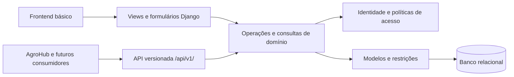

# InovaLab — Revisão e proposta de arquitetura

Versão 0.5 • 02/10/2026 • Identidade, catálogo, tarefas, agenda e adaptador local de recebimento externo entregues. O diagnóstico inicial permanece histórico; os módulos seguintes continuam propostos. C/D/P e F1–F4 são definidos no arquivo 01.

## 1. Resultado esperado

Desenvolver o sistema da documentação com interface básica de navegador e endpoints para integração futura. O núcleo reúne identidade, catálogo, tarefas, agenda, materiais e banners. Frontend e consumidores externos devem aplicar as mesmas operações de negócio.

Decisões confirmadas nesta revisão: backend Django, frontend básico e API; somente administradores aprovam, recusam e reabrem tarefas; cada reserva do MVP tem um único serviço, equipamento ou espaço, sem bloquear automaticamente recursos associados.

Recomendação de sucesso por etapa: um fluxo utilizável pelo navegador, sua API documentada quando aplicável e os cenários correspondentes de autorização e integridade verificados.

## 2. Revisão das fontes visuais

As seis imagens locais foram examinadas. Seus nomes não foram associados aos antigos `1.png` a `6.png`. O PDF original foi posteriormente adicionado e suas três páginas foram conferidas integralmente; o resultado está no arquivo 06. A tabela separa observação de decisão de produto.

| Tela F4 | Elementos observados | Consequência para requisitos |
| --- | --- | --- |
| `ADM - Tarefas.png` | Kanban com quatro estados, totais, busca, filtro, responsável e datas | Quadro visual confirmado; significado de datas, categorias e movimentação exige contrato operacional |
| `ADM - Agendamentos.png` | Calendário mensal, busca, categoria, mês e inclusão; “Demanda”, “Eventos” e “Reuniões” | Referência visual; esses indicadores não substituem serviço/equipamento/espaço sem decisão |
| `ADM - Dashboard.png` | Resumos de tarefas e reservas, recesso, feriado e evento | Painel pode agregar dados existentes; calendário institucional é expansão a validar |
| `ADM - Estoque.png` | Material, categoria, quantidade, status, fonte; terceiros/devolvidos; “Banners visíveis” | Provável inconsistência do rótulo; terceiros/devoluções sugerem regras ausentes em Q09, sem confirmar movimentações |
| `Banners.png` | Local home/sobre, três estados; ver, editar, desativar, excluir e ordem | Reforça campos existentes; programação e regra de ordenação pendentes em Q10/Q15 |
| `Usuarios.png` | “Gerencie os usuários do AgroHub”, professor/funcionário/visitante e paginação | Esclarecer identidade local versus externa; categorias institucionais não equivalem a permissões |

Números, nomes, fotos, cores e datas são exemplos visuais. Não carregar essas pessoas como usuários reais nem transformar totais em limites. Os totais da tela de usuários não fecham como categorias exclusivas; não deduzir sua taxonomia desses números. Serviços ilustrados nos cartões não ampliam automaticamente os onze serviços de RF11.

## 3. Diagnóstico do repositório

Verificação inicial executada no ambiente local em 01/10/2026, antes da implementação:

| Item | Evidência | Ação proposta |
| --- | --- | --- |
| Runtime | `venv` com Python 3.14.3 e Django 6.1.1 | Preservar inicialmente; verificar compatibilidade de DRF e documentação antes de instalar dependências |
| Inicialização | `manage.py check` falha: `Application labels aren't unique, duplicates: auth` | Substituir app vazio local por `accounts`, mantendo `django.contrib.auth`; inspecionar banco/migrações antes |
| Domínio | Modelos, views e testes de scaffold em `core`/`auth`; apenas `/admin/` nas URLs | Criar módulos por domínio e entregar fluxos completos por etapa |
| Dependências | Sem manifesto versionado; DRF ausente no `pip list` local | Registrar versões verificadas e instalação reproduzível |
| Configuração | Chave de desenvolvimento em código, debug ativo, hosts irrestritos e SQLite | Definir configuração por ambiente antes de publicação |
| Documentação | README era somente o nome; referências ignoradas pelo Git | Criar índice e registrar observações das imagens; decidir distribuição dos arquivos separadamente |

Comando de diagnóstico:

```powershell
& .\venv\Scripts\python.exe manage.py check
```

Essa é a linha de base com falha. Não houve servidor iniciado, implantação, alteração de banco nem testes funcionais bem-sucedidos nesta revisão documental.

**Atualização após o módulo 1:** `accounts` substitui o scaffold local `auth`, sem remover a autenticação nativa. Dependências diretas estão versionadas, configuração usa variáveis de ambiente e hosts locais por padrão. Migrações aplicadas no SQLite local; `check`, verificação de migrações e dependências passam. A entrega inclui contas no admin, login/logout, página privada e API de identidade, cobertos por 35 testes e verificação no Chrome. Consulte o [roteiro de depuração](docs/modules/01-identidade-e-acesso.md). O responsável deve depurar esta etapa antes de iniciar catálogo.

## 4. Alternativas de arquitetura

| Opção | Benefício | Custo e adequação |
| --- | --- | --- |
| **Monólito modular Django + templates + DRF (recomendado)** | Um backend/deploy, interface simples, API independente de telas e regras compartilhadas | Exige manter views/serializers finos; atende ao pedido atual |
| Django com frontend separado | Mais liberdade para interações complexas e evolução independente | Acrescenta build, autenticação entre origens e manutenção de duas aplicações; possível evolução com a mesma API |
| Serviços separados por domínio | Implantação e escala independentes | Acrescenta comunicação distribuída e consistência entre serviços; necessidade não confirmada para o MVP |

DRF foi instalado e verificado no módulo de identidade. Agenda local usa SQLite com UPDATE do alvo antes das leituras na transação e testes de conexões reais; `select_for_update()` sozinho não fornece bloqueio de linha nesse banco. PostgreSQL continua recomendado para produção com maior concorrência; banco e hospedagem de produção não foram aprovados/testados. Estratégia, limitações e referências estão no [guia da agenda](docs/modules/04-agenda.md).

## 5. Componentes e dependências



| Módulo proposto | Responsabilidade | Dependências principais |
| --- | --- | --- |
| `accounts` | Usuário configurável, autenticação e políticas de acesso | Autenticação e permissões nativas do Django |
| `catalogo` | Serviços, equipamentos e espaços | `accounts` para autorização |
| `tarefas` | Atribuição e transições de tarefas | `accounts`, `catalogo` |
| `agenda` | Reservas, disponibilidade e conflitos | `accounts`, `catalogo` |
| `integracoes` | Consumidores externos e adaptação de pedidos | `agenda`; consultas autorizadas do catálogo |
| `materiais` | Cadastro e quantidade conforme Q09 | `accounts`; movimentações não confirmadas |
| `conteudo` | Banners, arquivos WebP e publicação | `accounts`; armazenamento de arquivos a escolher |
| `core` | Layout, painel e elementos compartilhados | Consultas autorizadas dos módulos; sem concentrar regras de reserva/tarefa |

Separar modelos, operações (`services`), consultas (`selectors`), formulários, views, API e testes quando necessário. Não criar camadas vazias apenas para seguir um padrão.

Exemplo: formulário e endpoint de aprovação chamam a mesma operação de tarefas, que verifica ator, estado e concorrência antes de atualizar. Na reserva, autenticação externa ocorre no adaptador; disponibilidade e gravação permanecem em `agenda`.

## 6. Identidade, autorização e integridade

Recomenda-se `accounts.User` baseado em `AbstractUser`, definido antes das primeiras migrações de autenticação. Inspecionar eventual banco local antes de mudar `AUTH_USER_MODEL`: dados/migrações existentes podem exigir outro procedimento. [Orientação oficial do Django](https://docs.djangoproject.com/en/6.1/topics/auth/customizing/#using-a-custom-user-model-when-starting-a-project).

Representar administrador do negócio por grupo/permissões, sem exigir superusuário. Listas, detalhes e contagens de tarefas devem aplicar o escopo responsável/admin. DRF não filtra automaticamente listas pela permissão de cada objeto; a consulta precisa aplicar esse filtro. [Permissões do DRF](https://www.django-rest-framework.org/api-guide/permissions/#limitations-of-object-level-permissions).

Para reservas, três FKs opcionais e uma restrição de exatamente um alvo preservam Q05. Requerente externo usa dados mínimos acordados com o integrador, sem exigir usuário local. Categoria da API é validada contra o alvo; não usar tipo e ID sem referência íntegra no banco.

Na agenda entregue, todos os serviços/equipamentos/espaços são exclusivos, conforme Q05 confirmada. Criação, edição e cancelamento bloqueiam alvos em ordem estável antes de revalidar versão/conflitos e gravar evento. Dois pedidos conflitantes produziram um sucesso nos testes de conexões reais no SQLite. Cancelamento lógico e tratamento de indisponibilidade são escolhas provisórias para Q06/Q08.

## 7. Superfície proposta da API

Identidade, catálogo, tarefas, agenda e recebimento externo estão entregues conforme os contratos dos [módulos 1](docs/modules/01-identidade-e-acesso.md), [2](docs/modules/02-catalogo.md), [3](docs/modules/03-tarefas.md), [4](docs/modules/04-agenda.md) e [5](docs/modules/05-integracoes.md). Os caminhos dos demais módulos abaixo são propostas, **não endpoints existentes**. RF23 não concede acesso externo irrestrito aos módulos internos.

| Caminho proposto | Operação | Acesso e decisões |
| --- | --- | --- |
| `/api/v1/me/` (entregue) | Identidade atual e classificação de administrador do laboratório | Sessão válida; somente cinco campos do contrato, sem listar contas alheias |
| `/api/v1/servicos/` (entregue) | Consultar/criar/editar serviços; detalhes por ID | Sessão ativa consulta; administradores do laboratório escrevem; sem DELETE |
| `/api/v1/equipamentos/`, `/api/v1/espacos/` (entregues) | Consultar/criar/editar recursos; detalhes por ID | Mesma política do catálogo; sem agenda ou exclusão física |
| `/api/v1/tarefas/` e `/{id}/` (entregues) | Consultar, criar, editar e excluir logicamente | Consulta responsável/admin; campos/exclusão só admin; versão obrigatória; status protegido |
| `/api/v1/tarefas/{id}/transicoes/` (entregue) | Iniciar, enviar, aprovar, recusar ou reabrir | RN16; mapa operacional do módulo 3, com escolhas restantes identificadas como provisórias |
| `/api/v1/tarefas/{id}/historico/` e `/api/v1/tarefas/responsaveis/` (entregues) | Eventos autorizados e opções de atribuição | Histórico no mesmo escopo da tarefa; opções de contas ativas somente admin |
| `/api/v1/agendamentos/`, `/{id}/`, `/{id}/historico/` (entregues) | Agenda interna e eventos | Administrador ativo/superusuário; sessão/CSRF, versão, cancelamento lógico e conflitos 409 |
| `/api/v1/integracoes/agendamentos/` (entregue) | Receber pedido externo por POST | Token próprio, requerente/pedido externos, idempotência por cliente; consumidor real/Q07 ainda por validar |
| `/api/v1/integracoes/catalogo/` (entregue) | IDs/nomes reserváveis por categoria | Mesmo token; somente leitura paginada, sem agenda privada |
| `/api/v1/materiais/` | Consultar/manter materiais | Vocabulários Q09 e permissões Q12 |
| `/api/v1/banners/` | Administrar banners | Permissões Q12; programação/ordem Q10/Q15 |
| `/api/v1/publico/banners/` | Banners publicados por local | Leitura pública proposta com campos mínimos; sem rascunhos ou programação futura |

Para navegador, usar sessão Django e CSRF, inclusive nas chamadas JavaScript de escrita. [Autenticação por sessão no DRF](https://www.django-rest-framework.org/api-guide/authentication/#sessionauthentication). Login preserva a proteção CSRF do Django. A API externa entregue usa Bearer opaco próprio, com token aleatório, digest SHA-256 e revogação/renovação administrativas; o contrato está no módulo 5. OAuth/OIDC, login institucional e sincronização de usuários não estão confirmados.

O contrato deve especificar JSON, paginação, campos permitidos por ação, timestamps com fuso, identificadores estáveis e erros com código legível por máquina. Propostas: `400` para dados inválidos, `403` para operação proibida, `404` para objeto fora do escopo e `409` para conflito de horário, versão ou idempotência. Para ausência de credencial, documentar o autenticador escolhido: sessão no DRF pode retornar `403`; outros autenticadores usam `401`.

Idempotência externa entregue: chave única por cliente, conteúdo normalizado e reserva persistidos atomicamente; reenvio idêntico retorna a mesma reserva, com versão/estado atuais mesmo após edição ou cancelamento local. Conteúdo diferente com a mesma chave gera conflito 409. Reenvio não edita nem restaura a reserva.

## 8. Frontend básico

Proposta: templates Django, CSS responsivo e JavaScript para interações necessárias. Usar F4 como referência de navegação/cores, com campos e botões coerentes com permissões reais.

Entregar login, painel simples, catálogo, quadro/detalhe de tarefas, agenda/formulário, materiais e banners progressivamente. Kanban permite mudança por botão ou seletor; arrastar pode ser acrescentado. Contagens do usuário comum abrangem somente tarefas próprias; agenda e catálogo exigem autorização. Painel inicial não implica recessos, feriados ou notificações.

## 9. Etapas e critérios de entrega

Por instrução do responsável, concluir e entregar um módulo, aguardar sua depuração e autorização de avanço. Identidade e catálogo têm especificações e planos próprios; tarefas, agenda e integrações seguem execução direta com planos simples e escolhas provisórias documentadas, preservando testes e revisão independente.

| Etapa | Entrega proposta | Decisões necessárias | Verificação principal |
| --- | --- | --- | --- |
| 1. Identidade e acesso (entregue) | Colisão corrigida, configuração, usuário/papéis; contas no admin, login/logout, página privada e API de identidade | Responsável autorizou avançar para catálogo em 01/10/2026 | 35 testes passaram na entrega; fluxo web/API e admin verificados no Chrome |
| 2. Catálogo (entregue) | Serviços, equipamentos e espaços; frontend/API simples e carga dos 11 serviços | Responsável autorizou avanço para tarefas | 38 testes do catálogo; serviço referenciado por tarefa protegido; reservas serão tratadas na agenda |
| 3. Tarefas (entregue) | CRUD de admin, exclusão lógica, consulta restrita, quadro simples, transições e histórico web/API | Implementação direta autorizada; escolhas de datas, reabertura e exclusão para depuração | 44 testes de tarefas e suíte de 117 passando; revisão independente, fluxo completo básico no Chrome, teclado e 360 px |
| 4. Agenda (entregue) | Calendário mensal, CRUD/cancelamento lógico, histórico e API; proteção de sobreposição/versão | Q05 confirmada; escolhas Q06/Q08/Q13/Q14 para depuração; aguardar avanço para AgroHub | 42 testes de agenda, suíte159; conexões reais SQLite, revisão independente e Chrome, teclado/360 px |
| 5. Recebimento externo (entregue localmente) | Credencial, administração e recebimento idempotente preparados para AgroHub | F3 escolheu preparar API primeiro; validar consumidor real, ambiente e demais lacunasQ07 | 35 testes, suíte194, conexões reaisSQLite, revisão independente/Chrome; depurar antes de materiais |
| 6. Materiais | Cadastro e API acordada | Q09/Q12 e itens pertinentes de Q15 | CT21; sem movimentações implícitas |
| 7. Conteúdo | Banners, publicação e API acordada | Q10/Q12/Q15 | CT22–CT23; WebP real |

Na primeira etapa, provisionar contas pelo Django Admin, conforme Q11 confirmado. A especificação está em `docs/superpowers/specs/2026-10-01-identidade-e-acesso-design.md`. Contrato AgroHub, calendário institucional e estoque não bloqueiam começar identidade. Produção exige configuração própria, recuperação de banco/arquivos e metas RNF aprovadas; hospedagem não foi escolhida.

## 10. Processo de trabalho

As 15 skills de [obra/superpowers](https://github.com/obra/superpowers) foram instaladas em `C:\Users\PC2\.codex\skills` pelo instalador de skills do Codex. Isso não equivale a instalar o plugin de marketplace e seus hooks.

- [x] Ler documentação e scaffold.
- [x] Examinar seis telas e registrar divergências.
- [x] Registrar decisões sobre avaliação e alvo da reserva.
- [x] Verificar runtime e falha de inicialização.
- [x] Comparar abordagens e preparar esta proposta.
- [x] Validar arquitetura e decisões da primeira etapa.
- [x] Escrever e revisar especificação da primeira etapa.
- [x] Elaborar plano e definir execução com as skills pertinentes.
- [x] Implementar, verificar fluxo web/API e atualizar documentação da primeira etapa.
- [x] Receber autorização do responsável para avançar de identidade para catálogo.
- [x] Entregar catálogo com telas simples, testes automatizados e básicos no navegador.
- [x] Receber autorização de avanço para tarefas com implementação direta e plano simples.
- [x] Entregar tarefas, executar testes automatizados/básicos no navegador e revisão independente.
- [x] Receber autorização de avanço para agenda e decisão de exclusividade dos serviços.
- [x] Entregar agenda interna com testes automatizados, concorrência SQLite, navegador e revisão independente.
- [x] Receber autorização para preparar API de recebimento, com credencial própria/idempotência.
- [x] Entregar adaptador local, gestão de integradores, testes/revisão/navegador e contrato.
- [ ] Aguardar depuração do módulo5 e autorização antes de materiais; conectar AgroHub real em etapa acordada.

O processo padrão de design exige revisão antes de implementar; instruções do responsável prevalecem. Para tarefas e agenda, a execução direta com plano simples substituiu as passagens de aprovação de novos artefatos. As lacunas resolvidas durante a execução estão identificadas como escolhas provisórias nos guias/planos, sem serem apresentadas como novas respostas confirmadas. A revisão da agenda encontrou um Important corrigido com regressões RED/GREEN e um Minor histórico de horário de verão adiado, descrito no guia.
