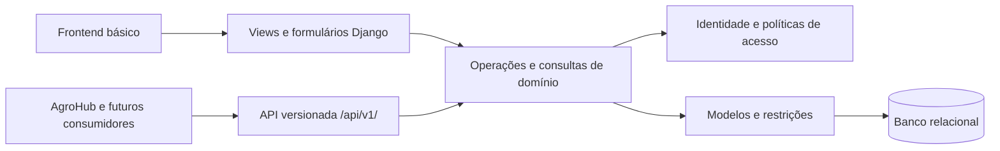

# InovaLab — Revisão e proposta de arquitetura

Versão 0.1 • 01/10/2026 • Proposta para discussão. Este arquivo registra diagnóstico, alternativas e etapas; não é uma especificação aprovada nem uma declaração de funcionalidades implementadas. C/D/P e F1–F4 são definidos no arquivo 01.

## 1. Resultado esperado

Desenvolver o sistema da documentação com interface básica de navegador e endpoints para integração futura. O núcleo reúne identidade, catálogo, tarefas, agenda, materiais e banners. Frontend e consumidores externos devem aplicar as mesmas operações de negócio.

Decisões confirmadas nesta revisão: backend Django, frontend básico e API; somente administradores aprovam, recusam e reabrem tarefas; cada reserva do MVP tem um único serviço, equipamento ou espaço, sem bloquear automaticamente recursos associados.

Recomendação de sucesso por etapa: um fluxo utilizável pelo navegador, sua API documentada quando aplicável e os cenários correspondentes de autorização e integridade verificados.

## 2. Revisão das fontes visuais

As seis imagens locais foram examinadas. Seus nomes não foram associados aos antigos `1.png` a `6.png`. O PDF original foi posteriormente adicionado e suas três páginas foram conferidas integralmente; o resultado está no arquivo 06. A tabela separa observação de decisão de produto.

| Tela F4 | Elementos observados | Consequência para requisitos |
| --- | --- | --- |
| `ADM - Tarefas.png` | Kanban com quatro estados, totais, busca, filtro, responsável e datas | Quadro visual confirmado; significado de datas, categorias e movimentação exige contrato operacional |
| `ADM - Agendamentos.png` | Calendário mensal, busca, categoria, mês e inclusão; “Demanda”, “Eventos” e “Reuniões” | Referência visual; esses indicadores não substituem serviço/equipamento/espaço sem decisão |
| `ADM - Dashboard.png` | Resumos de tarefas e reservas, recesso, feriado e evento | Painel pode agregar dados existentes; calendário institucional é expansão a validar |
| `ADM - Estoque.png` | Material, categoria, quantidade, status, fonte; terceiros/devolvidos; “Banners visíveis” | Provável inconsistência do rótulo; terceiros/devoluções sugerem regras ausentes em Q09, sem confirmar movimentações |
| `Banners.png` | Local home/sobre, três estados; ver, editar, desativar, excluir e ordem | Reforça campos existentes; programação e regra de ordenação pendentes em Q10/Q15 |
| `Usuarios.png` | “Gerencie os usuários do AgroHub”, professor/funcionário/visitante e paginação | Esclarecer identidade local versus externa; categorias institucionais não equivalem a permissões |

Números, nomes, fotos, cores e datas são exemplos visuais. Não carregar essas pessoas como usuários reais nem transformar totais em limites. Os totais da tela de usuários não fecham como categorias exclusivas; não deduzir sua taxonomia desses números. Serviços ilustrados nos cartões não ampliam automaticamente os onze serviços de RF11.

## 3. Diagnóstico do repositório

Verificação executada no ambiente local em 01/10/2026:

| Item | Evidência | Ação proposta |
| --- | --- | --- |
| Runtime | `venv` com Python 3.14.3 e Django 6.1.1 | Preservar inicialmente; verificar compatibilidade de DRF e documentação antes de instalar dependências |
| Inicialização | `manage.py check` falha: `Application labels aren't unique, duplicates: auth` | Substituir app vazio local por `accounts`, mantendo `django.contrib.auth`; inspecionar banco/migrações antes |
| Domínio | Modelos, views e testes de scaffold em `core`/`auth`; apenas `/admin/` nas URLs | Criar módulos por domínio e entregar fluxos completos por etapa |
| Dependências | Sem manifesto versionado; DRF ausente no `pip list` local | Registrar versões verificadas e instalação reproduzível |
| Configuração | Chave de desenvolvimento em código, debug ativo, hosts irrestritos e SQLite | Definir configuração por ambiente antes de publicação |
| Documentação | README era somente o nome; referências ignoradas pelo Git | Criar índice e registrar observações das imagens; decidir distribuição dos arquivos separadamente |

Comando de diagnóstico:

```powershell
& .\venv\Scripts\python.exe manage.py check
```

Essa é a linha de base com falha. Não houve servidor iniciado, implantação, alteração de banco nem testes funcionais bem-sucedidos nesta revisão documental.

## 4. Alternativas de arquitetura

| Opção | Benefício | Custo e adequação |
| --- | --- | --- |
| **Monólito modular Django + templates + DRF (recomendado)** | Um backend/deploy, interface simples, API independente de telas e regras compartilhadas | Exige manter views/serializers finos; atende ao pedido atual |
| Django com frontend separado | Mais liberdade para interações complexas e evolução independente | Acrescenta build, autenticação entre origens e manutenção de duas aplicações; possível evolução com a mesma API |
| Serviços separados por domínio | Implantação e escala independentes | Acrescenta comunicação distribuída e consistência entre serviços; necessidade não confirmada para o MVP |

DRF é proposto, não instalado. PostgreSQL é recomendado para a agenda com concorrência; banco e hospedagem ainda não foram aprovados. SQLite pode apoiar exploração local, mas os testes de concorrência devem usar o banco escolhido para a agenda: `select_for_update()` não fornece bloqueio de linha em SQLite. [Referência oficial do Django](https://docs.djangoproject.com/en/6.1/ref/models/querysets/#select-for-update).

## 5. Componentes e dependências



| Módulo proposto | Responsabilidade | Dependências principais |
| --- | --- | --- |
| `accounts` | Usuário configurável, autenticação e políticas de acesso | Autenticação e permissões nativas do Django |
| `catalogo` | Serviços, equipamentos e espaços | `accounts` para autorização |
| `tarefas` | Atribuição e transições de tarefas | `accounts`, `catalogo` |
| `agenda` | Reservas, disponibilidade e conflitos | `accounts`, `catalogo` |
| `integracoes` | Consumidores externos e adaptação de pedidos | `agenda`; consultas autorizadas do catálogo |
| `materiais` | Cadastro e quantidade conforme Q09 | `accounts`; movimentações não confirmadas |
| `conteudo` | Banners, arquivos WebP e publicação | `accounts`; armazenamento de arquivos a escolher |
| `core` | Layout, painel e elementos compartilhados | Consultas autorizadas dos módulos; sem concentrar regras de reserva/tarefa |

Separar modelos, operações (`services`), consultas (`selectors`), formulários, views, API e testes quando necessário. Não criar camadas vazias apenas para seguir um padrão.

Exemplo: formulário e endpoint de aprovação chamam a mesma operação de tarefas, que verifica ator, estado e concorrência antes de atualizar. Na reserva, autenticação externa ocorre no adaptador; disponibilidade e gravação permanecem em `agenda`.

## 6. Identidade, autorização e integridade

Recomenda-se `accounts.User` baseado em `AbstractUser`, definido antes das primeiras migrações de autenticação. Inspecionar eventual banco local antes de mudar `AUTH_USER_MODEL`: dados/migrações existentes podem exigir outro procedimento. [Orientação oficial do Django](https://docs.djangoproject.com/en/6.1/topics/auth/customizing/#using-a-custom-user-model-when-starting-a-project).

Representar administrador do negócio por grupo/permissões, sem exigir superusuário. Listas, detalhes e contagens de tarefas devem aplicar o escopo responsável/admin. DRF não filtra automaticamente listas pela permissão de cada objeto; a consulta precisa aplicar esse filtro. [Permissões do DRF](https://www.django-rest-framework.org/api-guide/permissions/#limitations-of-object-level-permissions).

Para reservas, três FKs opcionais e uma restrição de exatamente um alvo preservam Q05. Requerente externo usa dados mínimos acordados com o integrador, sem exigir usuário local. Categoria da API é validada contra o alvo; não usar tipo e ID sem referência íntegra no banco.

Para recursos exclusivos, propõe-se bloquear o registro do recurso na transação, consultar conflitos e gravar. Criação e edição seguem essa operação; troca de alvo bloqueia os recursos envolvidos em ordem estável. Política final depende de Q05/Q06/Q08. Verificar com duas conexões reais ao banco que pedidos conflitantes produzem no máximo um sucesso.

## 7. Superfície proposta da API

Os caminhos abaixo são propostas, **não endpoints existentes**. Implementar por etapa e gerar contrato correspondente ao código entregue. RF23 não concede acesso externo irrestrito aos módulos internos.

| Caminho proposto | Operação | Acesso e decisões |
| --- | --- | --- |
| `/api/v1/me/` | Identidade e capacidades | Usuário autenticado; sem listar contas alheias |
| `/api/v1/servicos/` | Consultar/manter serviços | Permissões Q12; integração recebe apenas campos aprovados |
| `/api/v1/equipamentos/`, `/api/v1/espacos/` | Consultar/manter recursos | Política do catálogo; sem revelar agenda privada |
| `/api/v1/tarefas/` e `/{id}/` | Consultar, criar, editar e excluir | Consulta responsável/admin; escrita de campos/exclusão somente admin; sem status genérico que contorne o fluxo |
| `/api/v1/tarefas/{id}/transicoes/` | Iniciar, enviar, aprovar, recusar ou reabrir | Campos e comandos por ação; RN16 e mapa aprovado |
| `/api/v1/agendamentos/` e `/{id}/` | Agenda interna | Administrador no escopo atual; exclusão/cancelamento Q08 |
| `/api/v1/integracoes/agendamentos/` | Receber pedido externo | Credencial, requerente e idempotência; payload Q07 |
| `/api/v1/materiais/` | Consultar/manter materiais | Vocabulários Q09 e permissões Q12 |
| `/api/v1/banners/` | Administrar banners | Permissões Q12; programação/ordem Q10/Q15 |
| `/api/v1/publico/banners/` | Banners publicados por local | Leitura pública proposta com campos mínimos; sem rascunhos ou programação futura |

Para navegador, recomenda-se sessão Django e CSRF, inclusive nas chamadas JavaScript de escrita. [Autenticação por sessão no DRF](https://www.django-rest-framework.org/api-guide/authentication/#sessionauthentication). Login deve preservar a proteção CSRF do Django. Token, OAuth/OIDC ou outra credencial de integração dependem de Q07; “Bearer” sozinho não define um protocolo. Login institucional e sincronização de usuários não estão confirmados.

O contrato deve especificar JSON, paginação, campos permitidos por ação, timestamps com fuso, identificadores estáveis e erros com código legível por máquina. Propostas: `400` para dados inválidos, `403` para operação proibida, `404` para objeto fora do escopo e `409` para conflito de horário, versão ou idempotência. Para ausência de credencial, documentar o autenticador escolhido: sessão no DRF pode retornar `403`; outros autenticadores usam `401`.

Idempotência externa proposta: chave única por origem, conteúdo normalizado e reserva persistidos atomicamente; reenvio idêntico retorna a reserva anterior; conteúdo diferente com a mesma chave gera conflito. Definir resposta após edição/cancelamento local antes de publicar esse contrato.

## 8. Frontend básico

Proposta: templates Django, CSS responsivo e JavaScript para interações necessárias. Usar F4 como referência de navegação/cores, com campos e botões coerentes com permissões reais.

Entregar login, painel simples, catálogo, quadro/detalhe de tarefas, agenda/formulário, materiais e banners progressivamente. Kanban permite mudança por botão ou seletor; arrastar pode ser acrescentado. Contagens do usuário comum abrangem somente tarefas próprias; agenda e catálogo exigem autorização. Painel inicial não implica recessos, feriados ou notificações.

## 9. Etapas e critérios de entrega

Cada etapa terá especificação e plano próprios após validação, evitando pressupor resolvidas todas as perguntas de negócio.

| Etapa | Entrega proposta | Decisões necessárias | Verificação principal |
| --- | --- | --- | --- |
| 1. Fundação e serviços | Corrigir colisão, configuração reproduzível, usuário/permissões; login, frontend de serviços, API e carga dos 11 serviços | Arquitetura, provisionamento Q11, autorização de serviços Q12 | Django inicia; login/logout; escrita sem permissão falha; carga repetida não duplica/sobrescreve; contrato acompanha API |
| 2. Tarefas | CRUD de admin, consulta restrita, Kanban e transições web/API | Q03 restante, Q04, Q08 para tarefas e histórico | CT01–CT08, CT25–CT28 e equivalência web/API |
| 3. Agenda | Equipamentos/espaços, agenda e proteção de conflito | Q05 restante, Q06, Q08 para reservas, Q12–Q14 e banco | CT09–CT15, CT19–CT20, incluindo concorrência no banco escolhido |
| 4. AgroHub | Contrato, credencial e recebimento idempotente | Q07, dados mínimos e alterações locais | CT16–CT18, CT28–CT29 e reenvio simultâneo |
| 5. Materiais e conteúdo | Cadastros, publicação e APIs acordadas | Q09/Q10/Q12 e itens pertinentes de Q15 | CT21–CT23; WebP real; sem movimentações implícitas |

Na primeira etapa, propõe-se provisionar contas pelo admin Django, se aprovado em Q11. Contrato AgroHub, calendário institucional e estoque não bloqueiam começar o núcleo. Produção exige configuração própria, recuperação de banco/arquivos e metas RNF aprovadas; hospedagem não foi escolhida.

## 10. Processo de trabalho

As 15 skills de [obra/superpowers](https://github.com/obra/superpowers) foram instaladas em `C:\Users\PC2\.codex\skills` pelo instalador de skills do Codex. Isso não equivale a instalar o plugin de marketplace e seus hooks.

- [x] Ler documentação e scaffold.
- [x] Examinar seis telas e registrar divergências.
- [x] Registrar decisões sobre avaliação e alvo da reserva.
- [x] Verificar runtime e falha de inicialização.
- [x] Comparar abordagens e preparar esta proposta.
- [ ] Validar arquitetura e decisões da primeira etapa.
- [ ] Escrever e revisar especificação da primeira etapa.
- [ ] Elaborar plano e definir execução com as skills pertinentes.
- [ ] Implementar, verificar fluxo web/API e atualizar documentação.

O processo `brainstorming` exige revisão do design antes de implementar. Esta revisão documental prepara uma proposta concreta; a aprovação de uma regra de negócio não transforma todo o desenho técnico em especificação aprovada.
