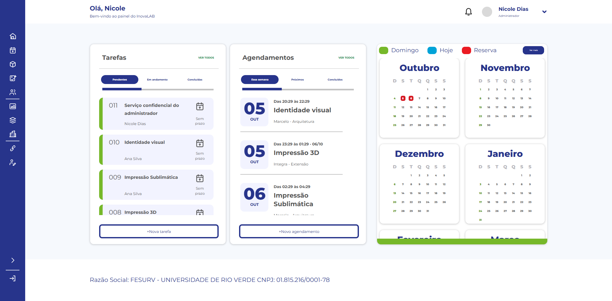

# Frontend — primeira entrega: base e Dashboard

Entrega de 05/10/2026. Abra `/painel/` após entrar, ou use **Dashboard** na página inicial da conta. O login e a página de identidade foram preservados. As outras telas continuam com seu visual anterior; sua migração será feita em entregas separadas, após a depuração desta parte.

## Referências e escopo

Foram examinadas as dez imagens em `Referencias/`, incluindo a barra lateral e os novos formulários. Esta entrega aplica o Dashboard e a base compartilhada: sidebar azul de 79 px, expansão para 283 px, cabeçalho de 74 px, cartões de 630 px, calendário e rodapé. Em 1920 × 946, os cartões começam em y=138; o rodapé começa em y=815. Em telas menores, o conteúdo se reorganiza e o menu vira uma gaveta acessível pelo teclado.

As áreas dos logotipos ficam **em branco**, por decisão do responsável. Não há marcas recortadas das referências ou inventadas. A fonte original não foi identificada; Montserrat variável foi incorporada localmente, com licença [SIL OFL](../../core/static/core/assets/OFL.txt) e [origem registrada](../../core/static/core/assets/README.md). Essa escolha e os ícones SVG próprios impedem afirmar identidade absoluta de todos os pixels com as imagens. O navegador não busca fontes, imagens ou bibliotecas em CDN.

As capturas abaixo usam registros de um banco temporário exclusivo da verificação; a aplicação mostra os dados reais do usuário conectado.



[Captura em 360 × 800](screenshots/dashboard-360.png).

## Comportamento atual

- Tarefas: **Pendentes** = Demanda; **Em andamento** = Criação/Avaliação; **Concluídas** = Concluído. Até dez itens por aba. Administrador vê todas; usuário comum e staff sem papel de negócio veem apenas as próprias. Excluídas não aparecem. As faixas indicam prazo vencido (vermelho), prazo informado (amarelo) ou sem prazo (verde); não representam prioridades novas.
- Agendamentos: somente administradores do laboratório. **Essa semana** inclui reservas ainda não terminadas que intersectam a semana de segunda a segunda; **Próximos** começa na próxima segunda; **Concluídos** considera término já atingido. Cancelados não aparecem. Até dez itens, com acesso à lista completa. Datas usam `America/Sao_Paulo`.
- Calendário: seis meses, começando pelo atual, domingo primeiro. A legenda reflete dados disponíveis: domingo, hoje e, somente para administradores, reserva. Não há cadastro de feriados/recessos. Reserva que termina exatamente à meia-noite não ocupa o dia seguinte. Usuário comum não recebe os contadores de reservas, nem links para a agenda.
- Links e botões levam às telas existentes. Conta técnica só aparece no menu de superusuários. Logout usa POST com CSRF. O Dashboard aceita GET/HEAD, exige autenticação ativa e usa `no-store`.
- Expansão/recolhimento, menu de perfil e gaveta móvel têm nomes acessíveis e funcionam pelo teclado. Escape fecha o menu aberto; na gaveta, o foco fica no menu e volta ao botão ao fechar. JavaScript local é necessário para a gaveta móvel.

Comentários, anexos, subtarefas, participantes adicionais, CPF, consumo de materiais e reserva de múltiplos recursos não foram acrescentados. Os novos formulários das referências serão tratados nas respectivas entregas, com os campos existentes.

## Verificação executada

```powershell
& .\venv\Scripts\python.exe manage.py test core
& .\venv\Scripts\python.exe manage.py test
& .\venv\Scripts\python.exe manage.py check
& .\venv\Scripts\python.exe manage.py makemigrations --check --dry-run
& .\venv\Scripts\python.exe -m pip check
```

12 testes novos do painel e 282 testes no total passaram. Sem alterações de modelos/migrações ou dependências. Chrome: login, filtros, abertura de tarefa, perfil por Enter, logout, menu expandido/recolhido, Escape e retorno de foco, bloqueio de dados alheios para usuário comum, nomes/serviços longos, 1920/1366/360 px. Sem rolagem horizontal nas verificações e sem falhas nos assets locais. Banco de navegador isolado: seus registros existentes não foram alterados.

## Depuração pelo responsável

1. Entrar com superusuário, administrador de negócio sem staff e usuário comum; conferir menus e tarefas visíveis.
2. Alternar abas, abrir detalhes e cadastros, conferir o limite de dez e as listas completas.
3. Conferir reservas atuais/futuras/terminadas e o calendário, incluindo virada de mês/ano e término à meia-noite.
4. Testar a barra lateral, menu do perfil e logout, teclado e larguras do navegador usadas no trabalho.
5. Avaliar fidelidade visual e nomes extensos com seus dados reais. Testes mais profundos, tecnologias assistivas e matriz completa de navegadores ficam para sua validação posterior.

## Tarefas futuras

- [ ] **Responsável fornecer/inserir as logos** InovaLAB, AgroHub e YpêTec nos espaços reservados.
- [ ] Confirmar a fonte original e, se disponível, substituir a escolha provisória.
- [ ] Migrar as demais telas para a base visual, uma entrega por vez, após depuração/autorização.

Desenho e plano: [spec](../superpowers/specs/2026-10-05-frontend-referencias-design.md), [plano](../superpowers/plans/2026-10-05-frontend-painel.md).
